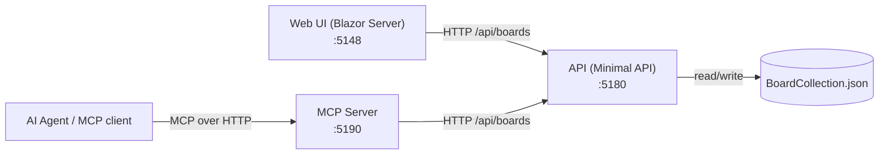

# ProjectManagementApp

A Kanban-style project management application built with Blazor Server (.NET 10). All data is persisted locally as a JSON file — no database or external services required.

The solution is split into three cooperating services plus a shared class library:

| Service | Project | Port | Role |
|---------|---------|------|------|
| **API** | `ProjectManagementApp.Api` | 5180 | Minimal API and **sole owner** of `BoardCollection.json` |
| **MCP** | `ProjectManagementApp.Mcp` | 5190 | [Model Context Protocol](https://modelcontextprotocol.io/) server exposing board tools to AI agents |
| **Web** | `ProjectManagementApp` (root) | 5148 | Blazor Server UI |

Both the Web UI and MCP server access data exclusively through the API over HTTP, so there is never more than one process writing to the JSON file.

## Features

- **Multiple boards** with customizable labels for lanes, cards, and todos
- **Lanes** (swimlanes) for organizing cards into columns
- **Cards** with title, description, notes, links, todos, and completion tracking
- **Drag-and-drop** card movement between lanes
- **Board-level and card-level todos** with a dedicated sidebar panel
- **Show/hide completed items** toggle
- **Collapse/expand all** cards for quick overview
- **Last-opened board memory** — reopens where you left off
- **Backup** with timestamped file export
- **Dark and light mode** support
- **Responsive design** with mobile-friendly modals

## Prerequisites

- [.NET 10 SDK](https://dotnet.microsoft.com/download/dotnet/10.0)

## Getting Started

### Start everything (recommended)

```powershell
# Clone the repo
git clone <repo-url>
cd ProjectManagementApp

# Launch all three services, each in its own PowerShell window
.\start-all.ps1
```

The script starts the services in order:

- **API** — http://localhost:5180 (start first; owns `BoardCollection.json`)
- **MCP** — http://localhost:5190
- **Web** — http://localhost:5148 (launches a browser)

### Start services manually

Start the API first — the other two depend on it:

```bash
# Terminal 1 — API
cd ProjectManagementApp.Api
dotnet run --launch-profile http

# Terminal 2 — MCP server (optional, only needed for AI agent access)
cd ProjectManagementApp.Mcp
dotnet run --launch-profile http

# Terminal 3 — Web UI
dotnet run --launch-profile http
```

Ports are configured in each project's `Properties/launchSettings.json`, and the API/MCP endpoint URLs consumed by the other services live in `appsettings.json` (`Endpoints` section).

## Architecture



- **`ProjectManagementApp.Core`** — shared class library with the data models (`KanbanModels`, `SearchModels`) and services: `BoardService` (JSON file persistence, used only by the API), `IBoardService`, and `BoardApiClient` (HTTP client implementation used by Web and MCP).
- **`ProjectManagementApp.Api`** — the single writer of `BoardCollection.json`. Exposes CRUD and search endpoints under `/api/boards` and a `/health` endpoint with a data-file health check.
- **`ProjectManagementApp.Mcp`** — exposes the full board feature set (list/search/create/update/move/delete for boards, lanes, cards, todos, and links) as MCP tools for AI agents. Proxies all data access through the API and reports API reachability on its `/health` endpoint.
- **`ProjectManagementApp`** (Web) — the Blazor Server UI. Includes a health status dashboard that monitors the API and MCP `/health` endpoints.

## Data Storage

### File Location

All board data is stored in a single JSON file:

```
{MyDocuments}\BoardCollection.json
```

On Windows this is typically:

```
C:\Users\{YourUsername}\Documents\BoardCollection.json
```

The path is resolved at runtime using `Environment.GetFolderPath(Environment.SpecialFolder.MyDocuments)`.

An info banner at the top of the board displays the exact file path for your system.

### JSON Structure

The file uses **camelCase** property naming and is written with indented formatting for readability.

```jsonc
{
  "boards": [
    {
      "id": "guid",
      "name": "My Board",
      "laneLabel": "Lane",       // Customizable label for lanes
      "cardLabel": "Card",       // Customizable label for cards
      "todoLabel": "Todo",       // Customizable label for todos
      "lanes": [
        {
          "id": "guid",
          "name": "To Do",
          "order": 0,
          "createdAt": "2026-01-01T00:00:00Z",
          "cards": [
            {
              "id": "guid",
              "title": "Card Title",
              "description": "Card description",
              "notes": "Free-form notes",
              "isCompleted": false,
              "createdAt": "2026-01-01T00:00:00Z",
              "completedAt": null,
              "order": 0,
              "todos": [
                {
                  "id": "guid",
                  "text": "Sub-task",
                  "isCompleted": false,
                  "createdAt": "2026-01-01T00:00:00Z",
                  "completedAt": null,
                  "order": 0
                }
              ],
              "links": [
                {
                  "id": "guid",
                  "title": "Link Title",
                  "url": "https://example.com",
                  "createdAt": "2026-01-01T00:00:00Z"
                }
              ]
            }
          ]
        }
      ],
      "todos": [
        // Board-level todos (same shape as card todos)
      ],
      "createdAt": "2026-01-01T00:00:00Z",
      "lastModified": "2026-01-01T00:00:00Z"
    }
  ],
  "lastOpenedBoardId": "guid"
}
```

### Backup

The app includes a backup button that copies `BoardCollection.json` to a timestamped file in the same Documents folder.

## Project Structure

```
ProjectManagementApp/
├── Components/                     # Web UI (Blazor Server)
│   ├── Pages/
│   │   ├── Home.razor              # Main Kanban board UI and logic
│   │   ├── Error.razor             # Error page
│   │   └── NotFound.razor          # 404 page
│   ├── Layout/
│   │   ├── MainLayout.razor        # App shell layout
│   │   ├── HealthStatus.razor      # Live health dashboard for API/MCP
│   │   ├── NavMenu.razor           # Sidebar navigation
│   │   └── ReconnectModal.razor    # Blazor Server reconnect UI
│   ├── App.razor                   # Root component
│   ├── Routes.razor                # Router configuration
│   └── _Imports.razor              # Global using directives
├── HealthChecks/
│   ├── HealthModels.cs             # Health dashboard models
│   └── HealthService.cs            # Polls API and MCP /health endpoints
├── Properties/
│   └── launchSettings.json         # Web dev server URL (port 5148)
├── wwwroot/                        # Static assets (CSS, Bootstrap)
├── Program.cs                      # Web startup — registers BoardApiClient
├── ProjectManagementApp.csproj     # .NET 10, Blazor Server Web SDK
│
├── ProjectManagementApp.Core/      # Shared class library
│   ├── Models/
│   │   ├── KanbanModels.cs         # BoardCollection, Board, Lane, Card, CardLink, TodoItem
│   │   └── SearchModels.cs         # Search result DTOs
│   └── Services/
│       ├── IBoardService.cs        # Shared service contract
│       ├── KanbanService.cs        # BoardService — JSON file read/write (API only)
│       └── BoardApiClient.cs       # HTTP client used by Web and MCP
│
├── ProjectManagementApp.Api/       # Minimal API — sole owner of the JSON file
│   ├── Program.cs                  # /api/boards endpoints + /health
│   └── BoardFileHealthCheck.cs     # Verifies the data file is accessible
│
├── ProjectManagementApp.Mcp/       # MCP server for AI agents
│   ├── Program.cs                  # MCP over HTTP transport + /health
│   ├── BoardTools.cs               # MCP tools covering the full board feature set
│   └── ApiHealthCheck.cs           # Verifies the API is reachable
│
├── ProjectManagementApp.Tests/
│   ├── BoardServiceTests.cs        # BoardService persistence/CRUD tests (temp dir)
│   ├── KanbanModelsTests.cs        # Model default/behavior tests
│   └── UnitTest1.cs                # bUnit component tests for Home page
│
├── start-all.ps1                   # Launches API, MCP, and Web in separate windows
└── ProjectManagementApp.sln
```

## Data Models

| Model | Purpose |
|-------|---------|
| `BoardCollection` | Root object — list of boards and the last-opened board ID |
| `Board` | A named board with lanes, board-level todos, and custom labels |
| `Lane` | A column within a board containing ordered cards |
| `Card` | A work item with title, description, notes, links, todos, and completion state |
| `CardLink` | A titled URL attached to a card |
| `TodoItem` | A checklist item (used at both board and card level) |

All entities use `Guid` IDs generated at creation time.

## Running Tests

```bash
cd ProjectManagementApp.Tests
dotnet test
```

Tests use [xUnit](https://xunit.net/) (v2.9.3) and [bUnit](https://bunit.dev/) (v2.6.2) and cover:

- **BoardServiceTests** — persistence and CRUD behavior of `BoardService` against a temp directory (never touches your real data file)
- **KanbanModelsTests** — model defaults and behavior
- **UnitTest1** — bUnit component tests verifying the Home page renders key UI elements

## Tech Stack

- **Framework**: .NET 10 / ASP.NET Core
- **UI**: Blazor Server with Interactive Server render mode
- **API**: ASP.NET Core Minimal APIs with health checks
- **AI integration**: Model Context Protocol (MCP) server with HTTP transport
- **Styling**: Scoped CSS + Bootstrap 5
- **Persistence**: Local JSON file (no database), owned exclusively by the API process
- **Testing**: xUnit + bUnit
